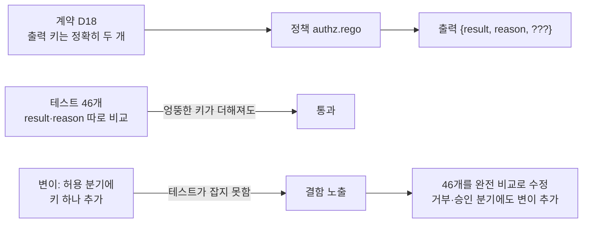
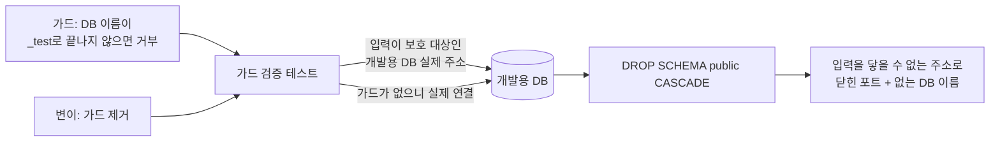
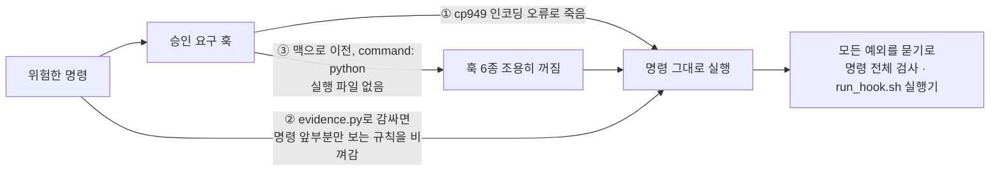

# 에이전트 권한 브로커

AI 에이전트의 모든 도구 호출을 허용 · 거부 · 승인 중 하나로 판단하고, 판단 근거를 위변조가 드러나는 감사 로그로 남기는 검문소입니다.

진행 중 (2026.09 ~)

## 프로젝트 목적

기업이 에이전트 도입을 망설이는 가장 큰 이유는 "에이전트에게 권한을 어디까지 줘도 되나"입니다. 프롬프트 주입에 당한 에이전트가 권한 밖의 데이터를 읽거나, 한도를 쪼개서 우회하거나, 승인받은 뒤 인자를 바꾸는 일이 생길 수 있습니다.

이런 통제를 에이전트 자신의 프롬프트에 맡기면, 통제하려는 대상이 통제 장치를 들고 있는 셈이 됩니다. 그래서 에이전트 바깥의 코드로 막는 것을 목표로 했습니다. 에이전트는 실제 API 키를 가지지 않고, 모든 도구 호출을 브로커에 요청합니다.

설계의 첫째 원칙은 판단할 수 없을 때 어느 쪽으로 넘어지는가입니다. 입력이 없거나 필드가 빠지거나 정책을 읽지 못하면 전부 거부합니다(fail-closed). 이 원칙은 브로커의 정책뿐 아니라 개발 하네스 자체에도 같이 적용합니다.

1인 프로젝트이고, 브로커를 거치지 않으면 도구를 호출할 수 없는 최소 형태를 만드는 1단계를 진행 중입니다.

| 작업 | 내용 | 상태 |
| --- | --- | --- |
| A | 개발 환경 — 패키지 · 이미지 버전 고정, Docker Compose(PostgreSQL · Redis · OPA) | 완료 |
| B | pytest 설정, GitHub Actions CI | 완료 |
| D | OPA 정책 — 입력 · 출력 계약(D18), 규칙별 `opa test` | 완료 |
| C | 데이터 모델 — 테이블 4개, Alembic, 시드(D21) | 완료 |
| E ~ L | 모의 도구, 게이트웨이, 데모 에이전트, 1단계 완료 판정 | 대기 |

현재 위치와 다음 할 일은 [1단계 계획서](docs/stage1-plan.md) 2장 · 4장에 있습니다.

## 사용 기술 스택

| 구분 | 기술 | 선택한 이유 |
| --- | --- | --- |
| 언어 | Python 3.13.7 | CI가 패치 번호까지 고정하므로 로컬도 같은 값을 씁니다 |
| 정책 엔진 | Open Policy Agent (Rego) | 권한 판단을 애플리케이션 코드에서 떼어내, 정책만 따로 테스트하고 바꿀 수 있게 했습니다 |
| 데이터베이스 | PostgreSQL, SQLAlchemy, Alembic | 위임 · 한도 · 승인 · 감사 로그를 한 트랜잭션에서 다뤄야 했습니다 |
| 캐시 | Redis | 누적 한도의 예약과 확정에 쓸 예정입니다 |
| 실행 환경 | Docker Compose (PostgreSQL · Redis · OPA) | 세 서비스의 이미지 버전을 고정해 어느 OS에서든 같은 구성으로 띄웁니다 |
| 테스트 · CI | pytest, GitHub Actions, `opa test`, 변이 테스트 | 통과하는 테스트와 믿을 수 있는 테스트를 구분하려고 변이 절차를 함께 씁니다 |

## 아키텍처 구조


정책의 입력은 `{agent, user, action: {name, risk}, delegation: {scopes, per_tx_limit, expires_at}, args}`이고 출력은 `{result, reason}`으로 키가 정확히 두 개입니다. 이유 코드에는 우선순위가 있습니다. `invalid_input` > `invalid_args` > `action_not_in_scope` > `delegation_expired` > `per_tx_limit_exceeded` > `approval_required_*` > `low_risk_in_scope`(허용) 순입니다.

1단계에서는 승인이 필요한 요청(위험도 높음 · 중간, 사내 밖 수신자 메일)도 일단 거부합니다. 2단계에서 `require_approval`로 바꿉니다. 계약 원문은 [설계 결정 D18](docs/decisions.md)에 있습니다.

## 역할과 기여도

1인 프로젝트로 설계와 구현, 테스트 절차를 모두 직접 만들었습니다.

- 권한 판단 정책을 Rego로 작성했습니다. 기본값 거부, 입력 검증, 이유 코드 우선순위를 규칙으로 두고 규칙별 `opa test`를 붙였습니다.
- 정책의 입력 · 출력 계약을 설계 결정 문서에 고정하고, 테스트가 그 계약을 완전 비교로 확인하게 했습니다.
- 데이터 모델 테이블 4개와 Alembic 마이그레이션, 시드 데이터를 만들었습니다.
- 테스트를 믿을 수 있는지 확인하는 변이 절차를 세웠습니다. 정책과 코드를 일부러 망가뜨리고 기대한 테스트가 정확히 실패하는지 대조합니다.
- 통합 테스트가 서비스 부재를 조용히 건너뛰지 않고 실패하도록 구성했습니다.
- 개발 하네스의 훅과 증거 기록 도구를 fail-closed로 고치고, 하네스가 현재 OS에서 살아 있는지 판정하는 테스트를 추가했습니다.
- 모든 실행 결과를 해시가 붙은 증거 로그로 남기고 `evidence.py --verify`로 무결성을 확인합니다.

## 트러블슈팅 해결 과정

작업마다 계획 → 검증 → 구현 → 검증 → 테스트 순서를 거칩니다. 그 과정에서 만난 문제 중 지금까지 가장 중요했던 세 가지이고, 개발이 진행되면서 더 중요한 문제가 나오면 이 목록은 바뀝니다. 전체 기록은 [개발 위키](docs/wiki/Home.md)에 있습니다.

### 테스트 46개가 통과하는데도 계약을 지키지 못하던 문제를 변이 테스트로 드러내 해결

**문제 흐름**



**문제 원인**

- 정책 테스트는 판단 결과가 `{"result": ..., "reason": ...}`와 완전히 같은지 확인하도록 계획했음
- 그런데 구현된 테스트 46개는 `result`와 `reason`을 따로 비교했음. 이러면 정책이 출력에 엉뚱한 키를 더해도 테스트가 통과함
- 계약(D18)은 "출력 키는 정확히 두 개"인데 테스트가 그 약속을 지키지 못하고 있었고, 테스트가 전부 통과하고 있어서 겉으로는 드러나지 않았음
- 같은 유형의 문제가 CI 테스트(작업 B)에서도 먼저 있었음

**해결 과정**

- 정책 코드를 한 줄씩 일부러 망가뜨리고(변이), 그때 실패해야 할 테스트가 정확히 실패하는지 확인하는 절차를 세움
- 허용 분기에 키를 하나 더하는 변이가 이 결함을 드러냄
- 테스트 46개를 모두 완전 비교로 고치고, 거부 분기(변이 x)와 승인 분기(변이 y)에도 같은 변이를 추가함

**테스트**

- 환경: `docker compose run --rm opa test /policies -v`
- 변이 25종을 각각 적용해 기대한 테스트 이름과 실제 실패한 테스트 이름을 대조
- 변이 x는 37개, y는 7개로 이름까지 정확히 기대한 테스트만 실패
- 원래 정책으로 되돌리면 54개 테스트가 모두 다시 통과

**결과** 어느 분기에서 출력 형식이 흐트러져도 테스트가 잡아냄

**배운 점** 통과하는 테스트와 믿을 수 있는 테스트는 다르며, 테스트의 강도는 코드를 망가뜨려 봐야 알 수 있음 → [문제 기록](docs/wiki/troubleshooting/ci-test-spec-quantifier-weakening.md)

### 안전장치를 확인하려던 테스트가 안전장치가 없을 때의 피해를 실제로 입은 문제를 입력 교체로 해결

**문제 흐름**



**문제 원인**

- 테스트 도우미에는 스키마를 지우기 전에 DB 이름을 확인하는 가드가 있음. 이름이 `_test` 또는 `_test_mig`로 끝나지 않으면 연결도 하기 전에 거부해, 개발용 DB를 실수로 날리지 않게 하는 장치임
- 그 가드가 진짜 막는지 확인하는 테스트가 보호 대상인 개발용 DB의 실제 주소를 입력으로 쓰고 있었음
- 이 프로젝트는 테스트가 통과하는 것만으로 믿지 않고 코드를 일부러 망가뜨려 그때 테스트가 실제로 실패하는지 확인하는데, 그 변이 중 하나가 가드를 제거하는 변이였음
- 가드가 사라진 상태에서 그 주소는 실제로 연결됐고, `DROP SCHEMA public CASCADE`가 개발용 DB에 그대로 실행됨
- 같은 날 다른 테스트에도 같은 성격의 문제가 있었음. 인터프리터가 없을 때 훅이 막는지 보는 테스트가 `.venv`가 없다는 환경 상태에 기대고 있어서, `.venv`를 만들자 무력해짐

**해결 과정**

- 테스트 입력을 닿을 수 없는 주소(닫힌 포트 + 존재하지 않는 DB 이름)로 바꿈. 가드가 있으면 이름만 보고 연결 전에 `ValueError`로 거부하고, 가드가 없으면 연결이 거부돼 `OperationalError`가 나므로 테스트는 여전히 실패함
- 통과 조건인 `ValueError`를 내는 코드가 가드뿐이라 검증력은 그대로면서 피해 가능성만 사라짐
- 훅 쪽도 `.venv`가 없는 임시 저장소를 테스트가 직접 만들도록 고침
- 두 사건을 하나의 규칙으로 올려, 계획 검증 단계에서 ① 가드를 제거하는 변이가 있으면 그 테스트 입력이 실제 보호 대상인지, ② 실패 조건을 환경 상태에 기대고 있지는 않은지를 확인하게 함

**테스트**

- 환경: 실제 PostgreSQL, `docker compose up -d postgres`
- 고친 뒤 변이를 같은 이름으로 다시 돌려, 기대한 테스트 하나만 정확히 실패하고(`exit 1`) 되돌리면 70개가 모두 통과하는 것을 확인

**결과** 검증력을 유지하면서 테스트가 보호 대상에 닿을 수 없게 됨. 개발용 DB는 원래 비어 있어 손실은 없었지만, "비어 있었다"를 사후에 증명할 수 없다는 점도 기록에 남김

**배운 점** 가드를 검증하는 테스트는 보호 대상을 입력으로 쓰면 안 되고, 실패 조건을 환경 상태에 기대면 환경이 바뀌는 순간 무력해짐 → [문제 기록](docs/wiki/troubleshooting/guard-test-destroyed-the-resource-it-guards.md) · [같은 계열](docs/wiki/troubleshooting/fail-closed-test-relied-on-missing-venv.md)

### 검문소를 만드는 개발 도구 자신이 실패하면 통과였던 문제를 세 번에 걸쳐 fail-closed로 고침

**문제 흐름**



**문제 원인**

- 이 프로젝트의 첫째 원칙은 문제가 생기면 전부 막는다(fail-closed)인데, 개발 하네스에서 이 원칙이 세 번 깨졌음
- ① 위험한 명령에 사람 승인을 요구하는 훅이 Windows 인코딩(cp949) 오류로 죽으면 명령이 그대로 실행됐음
- ② 권한 규칙이 명령 앞부분만 보기 때문에, 증거 기록 도구(`evidence.py`)로 명령을 감싸면 승인 요구를 피할 수 있었음
- ③ 개발 환경을 맥으로 옮기자 훅 6종이 전부 조용히 꺼졌음. 훅 설정이 `command: python`이었는데 맥에는 그 이름의 실행 파일이 없음(있는 것은 `python3`). 훅이 시작하지 못하면 명령은 그대로 통과하고, 훅이 허용한 것과 훅이 죽은 것을 밖에서는 구분할 수 없음

**해결 과정**

- ① 훅은 출력을 ASCII로 바꾸고, 입력 해석 실패를 포함한 모든 예외를 "사람에게 묻기"로 처리함
- ② `evidence.py`는 실행 전에 권한 설정의 ask · deny 규칙을 명령 문자열 전체에서 찾아, 걸리면 실행하지 않고 종료 코드 126으로 거부함. 설정을 읽지 못해도 거부함
- ③ 훅을 `run_hook.sh` 실행기를 거쳐 부르게 바꿔 OS에 맞는 인터프리터를 찾고, 못 찾으면 실행기가 직접 승인 요구나 거부를 내도록 함

**테스트**

- 훅: 명령 26개 × 셸 2종(52건)과 잘못된 입력 3건을 넣어 확인, 기대와 다른 판정 0건
- `evidence.py`: 차단해야 할 명령 17건과 허용해야 할 명령 9건이 모두 기대대로 처리됨. `curl --version`을 감싸 보내도 126으로 거부되고 증거 파일도 생기지 않음
- 세 번째 문제는 실제 Claude Code 세션에서 `git push`가 든 명령이 차단되는 것을 확인하고, 하네스가 이 OS에서 살아 있는지를 판정하는 테스트 35개를 추가

**결과** 세 경로 모두 실패 시 통과가 아니라 거부나 승인 요구로 넘어지게 됨. 다음에 환경을 옮길 때는 `pytest` 한 번으로 드러남

**배운 점** 안전장치는 정상 동작이 아니라 죽었을 때 어느 쪽으로 넘어지는가로 평가해야 하고, 그 판정은 테스트로 남겨야 함 → [훅 인코딩 문제](docs/wiki/troubleshooting/hook-cp949-fail-open.md) · [권한 우회 문제](docs/wiki/troubleshooting/evidence-tool-permission-bypass.md) · [맥에서 훅이 죽은 문제](docs/wiki/troubleshooting/hooks-dead-on-macos.md)

## 결과

진행 중인 프로젝트입니다. 아래는 작업 C 기준입니다.

| 항목 | 결과 |
| --- | --- |
| `opa test` 정책 단위 테스트 | 54/54 통과, 3회 반복해도 같은 결과 |
| pytest 단위 (CI 설정 · 정책 정적 검사 · 하네스 훅 점검 · DB 설정 · 시드 상수) | 70 passed |
| pytest 통합 (`@pytest.mark.integration`, 실제 PostgreSQL) | 27 passed, skip 0 |
| 의존성을 멈췄을 때 | PostgreSQL을 끄면 통합 테스트가 조용히 건너뛰지 않고 27개 전부 오류 |
| 변이 테스트 (작업 C) | 37종 전부 기대한 테스트 집합과 정확히 일치, 되돌리면 전부 통과 |
| 증거 무결성 (`evidence.py --verify`) | 작업 C의 로그 134개 전부 해시 일치 (로그 자체는 개발용 DB 비밀번호가 평문으로 남아 커밋하지 않았다 — 이후 로그는 `evidence.py`가 쓰기 전에 마스킹한다) |

브로커 게이트웨이와 모의 도구, 데모 에이전트는 아직 만들지 않았습니다. 현재까지 동작을 확인한 것은 정책 판단과 데이터 모델, 그리고 개발 하네스입니다.

## 문서

- [아키텍처](docs/architecture.md)
- [설계 결정](docs/decisions.md)
- [진행 계획](docs/plan.md)
- [1단계 계획 · 현재 상태](docs/stage1-plan.md)
- [개발 위키 (작업 기록 · 문제 해결)](docs/wiki/Home.md)

## 로컬 실행

맥 · 윈도우(Git Bash) · 리눅스에서 같은 명령을 씁니다.

```bash
cp env.example .env
sh .claude/tools/python.sh -m venv .venv
sh .claude/tools/python.sh -m pip install -r requirements-dev.txt
```

Python은 3.13.7을 씁니다. CI(`.github/workflows/ci.yml`)가 패치 번호까지 고정하므로 로컬도 같은 값을 맞춥니다. 그 버전이 없다면 `uv python install 3.13.7`로 받은 인터프리터로 `.venv`를 만드십시오. `.venv`는 반드시 저장소 루트에 둡니다. 아래 실행기와 훅이 그 경로를 먼저 찾습니다.

`.claude/tools/python.sh`는 `.venv/bin/python`(맥 · 리눅스)과 `.venv/Scripts/python.exe`(윈도우)를 먼저 찾고, 없으면 `python3` → `python` → `py` 순서로 찾습니다. 맥에는 `python`이라는 이름의 명령이 없어서, 이 실행기를 거치면 두 OS의 명령 원문이 같아집니다.

## 테스트 실행

```bash
MSYS_NO_PATHCONV=1 docker compose run --rm opa test /policies -v   # 정책 단위 테스트 (작업 D 기준 54개)
sh .claude/tools/python.sh -m pytest -q -m "not integration"       # 단위 테스트만 (서비스 불필요)
sh .claude/tools/python.sh -m pytest -q -m integration             # 통합 테스트 (PostgreSQL 필요)
sh .claude/tools/python.sh -m pytest -q                            # 전부
```

통합 테스트는 `docker compose up -d postgres`가 떠 있어야 하고, 서비스가 없으면 건너뛰지 않고 실패합니다. 조용한 skip은 "확인했다"와 구분되지 않기 때문입니다. `broker_test`와 `broker_test_mig` 데이터베이스를 스스로 만들어 쓰고 개발용 `broker`는 건드리지 않습니다.

첫 명령의 `MSYS_NO_PATHCONV=1`은 윈도우 Git Bash가 컨테이너 안의 경로 `/policies`를 윈도우 경로로 바꾸지 못하게 막는 설정입니다. 맥 · 리눅스에서는 아무 일도 하지 않으므로 OS와 상관없이 항상 붙입니다. CI가 main 푸시와 PR마다 같은 두 명령을 실행합니다(pytest는 junit xml 옵션만 추가).
