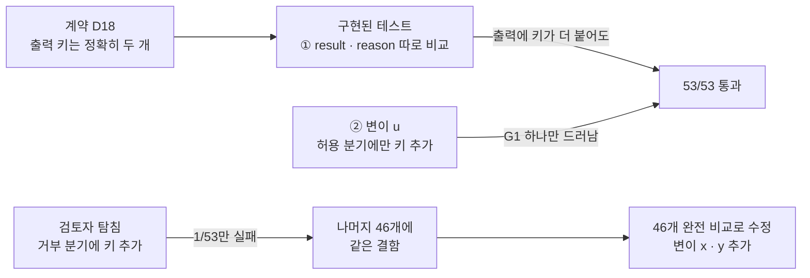
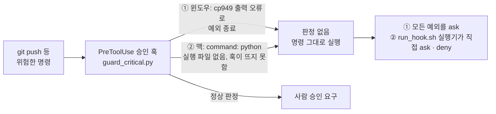
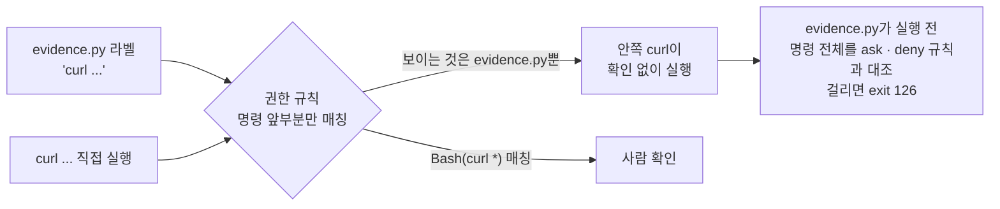
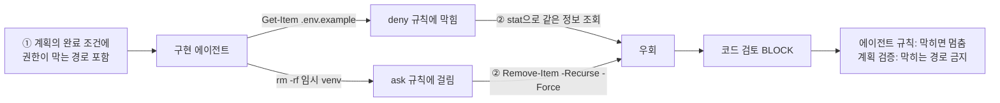

# 에이전트 권한 브로커

AI 에이전트의 모든 도구 호출을 허용 · 거부 · 승인 중 하나로 판단하고 판단 근거를 위변조가 드러나는 감사 로그로 남기는 검문소를 만들고 있습니다. 지금은 정책 판단과 데이터 모델까지 동작합니다.

## 개요

| 항목 | 내용 |
| --- | --- |
| 기간 | 2026.09 ~ 진행 중 |
| 인원과 역할 | 1인 — 설계 · 정책 · 데이터 모델 · 테스트 절차 · 개발 하네스 전체 |
| 상태 | 진행 중. 브로커를 거치지 않으면 도구를 호출할 수 없는 최소 형태를 만드는 1단계 |
| 핵심 기술 | Python 3.13 · OPA(Rego) · PostgreSQL · SQLAlchemy · Alembic · Docker Compose · pytest · GitHub Actions · 변이 테스트 |

에이전트를 업무에 붙일 때 먼저 부딪히는 질문은 "에이전트에게 권한을 어디까지 줘도 되나"입니다. 프롬프트 주입에 당한 에이전트가 권한 밖의 데이터를 읽거나, 한도를 쪼개서 우회하거나, 승인받은 뒤 인자를 바꾸는 일이 생길 수 있습니다.

이런 통제를 에이전트 자신의 프롬프트에 맡기면 통제하려는 대상이 통제 장치를 들고 있는 셈이 됩니다. 그래서 에이전트 바깥의 코드로 막는 것을 목표로 했습니다. 에이전트는 실제 API 키를 가지지 않고 모든 도구 호출을 브로커에 요청합니다.

설계의 첫째 원칙은 판단할 수 없을 때 어느 쪽으로 넘어지는가입니다. 입력이 없거나 필드가 빠지거나 정책을 읽지 못하면 전부 거부합니다(fail-closed). 이 원칙은 브로커의 정책뿐 아니라 브로커를 만드는 개발 하네스(Claude Code 훅 · 권한 규칙 · 증거 기록 도구)에도 같이 적용합니다. 아래 문제 해결 사례 중 여러 건이 이 원칙을 개발 도구 자신에게 적용하지 못한 데서 나왔습니다.

| 작업(진행 순) | 내용 | 상태 |
| --- | --- | --- |
| A | 개발 환경 — 패키지 · 이미지 버전 고정, Docker Compose(PostgreSQL · Redis · OPA) | 완료 |
| B | pytest 설정, GitHub Actions CI | 완료 |
| D | OPA 정책 — 입력 · 출력 계약(D18), 규칙별 `opa test` | 완료 |
| C | 데이터 모델 — 테이블 4개, Alembic, 시드(D21) | 완료 |
| E | 모의 도구 — MCP 서버 3개(경비 · 메일 · 고객 DB), 공유 비밀 헤더 검사(D19) | 계획 승인 대기 |
| F ~ L | 게이트웨이, 데모 에이전트, 1단계 완료 판정 | 대기 |

현재 위치와 다음 할 일은 [1단계 계획서](docs/stage1-plan.md) 2장 · 4장에 있습니다.

## 아키텍처


정책의 입력은 `{agent, user, action: {name, risk}, delegation: {scopes, per_tx_limit, expires_at}, args}`이고 출력은 `{result, reason}`으로 키가 정확히 두 개입니다. 이유 코드에는 우선순위가 있습니다. `invalid_input` > `invalid_args` > `action_not_in_scope` > `delegation_expired` > `per_tx_limit_exceeded` > `approval_required_*` > `low_risk_in_scope`(허용) 순입니다.

1단계에서는 승인이 필요한 요청(위험도 높음 · 중간, 사내 밖 수신자 메일)도 일단 거부합니다. 2단계에서 `require_approval`로 바꿉니다. 계약 원문은 [설계 결정 D18](docs/decisions.md)에 있습니다. 위 그림에서 지금 동작하는 부분은 OPA 정책과 데이터 모델이고, 게이트웨이 · 임시 토큰 · 승인 · 감사 워커는 설계만 되어 있습니다.

## 기술 스택

| 구분 | 기술 | 선택한 이유 |
| --- | --- | --- |
| 언어 | Python 3.13.7 | CI가 패치 번호까지 고정하므로 로컬도 같은 값을 씁니다 |
| 정책 엔진 | Open Policy Agent (Rego) | 권한 판단을 애플리케이션 코드에서 떼어내, 정책만 따로 테스트하고 바꿀 수 있게 했습니다 |
| 데이터베이스 | PostgreSQL, SQLAlchemy, Alembic | 위임 · 한도 · 승인 · 감사 로그를 한 트랜잭션에서 다뤄야 했습니다 |
| 캐시 | Redis | 누적 한도의 예약과 확정에 쓸 예정입니다 |
| 실행 환경 | Docker Compose (PostgreSQL · Redis · OPA) | 세 서비스의 이미지 버전을 고정해 어느 OS에서든 같은 구성으로 띄웁니다 |
| 테스트 · CI | pytest, GitHub Actions, `opa test`, 변이 테스트 | 통과하는 테스트와 믿을 수 있는 테스트를 구분하려고 변이 절차를 함께 씁니다 |

## 문제 해결 사례

작업마다 계획 → 계획 검증 → 구현 → 구현 검증 → 테스트 순서를 거칩니다. 설계 · 정책 계약 · 검증 절차는 제가 정했고, 각 단계의 실행은 역할을 나눈 Claude Code 서브에이전트(계획 · 검토 · 구현 · 테스트)에 맡긴 뒤 단계마다 검토 결과를 보고 승인했습니다. 아래에서 "검토자"는 검토 담당 에이전트, "탐침"은 테스트나 정책을 일부러 약하게 만든 사본으로 테스트가 잡아내는지 시험해 본 것입니다. 전체 기록은 [개발 위키](docs/wiki/Home.md)에 있습니다.

1. [테스트 46개가 통과하는데도 계약을 지키지 못하던 문제를 변이 테스트로 드러내 해결](#1-테스트-46개가-통과하는데도-계약을-지키지-못하던-문제를-변이-테스트로-드러내-해결)
2. [승인 훅이 죽으면 명령이 그대로 통과하던 문제를 두 번에 걸쳐 fail-closed로 고침](#2-승인-훅이-죽으면-명령이-그대로-통과하던-문제를-두-번에-걸쳐-fail-closed로-고침)
3. [증거 기록 도구로 감싼 명령이 권한 규칙을 비껴가던 구멍을 도구 안에서 막음](#3-증거-기록-도구로-감싼-명령이-권한-규칙을-비껴가던-구멍을-도구-안에서-막음)
4. [서브에이전트가 거부당한 명령을 다른 명령으로 우회한 일을 에이전트 규칙과 계획 검증으로 금지함](#4-서브에이전트가-거부당한-명령을-다른-명령으로-우회한-일을-에이전트-규칙과-계획-검증으로-금지함)

### 1. 테스트 46개가 통과하는데도 계약을 지키지 못하던 문제를 변이 테스트로 드러내 해결

**문제 흐름**



**문제 원인**
- 배경: 정책은 판단 결과를 `{"result": ..., "reason": ...}`로 내고, 설계 결정 D18은 "출력 키는 정확히 두 개"로 정함
- 계획한 테스트 53개가 첫 실행에서 모두 통과했지만, 검토자가 거부 분기 출력에 키를 더하는 탐침을 돌리자 53개 중 1개만 실패
- ① 46개 테스트가 계획한 완전 비교 대신 `d.result == X`, `d.reason == Y`를 따로 비교해 키가 더 붙어도 통과
- ② 계획의 변이 표가 "완전히 같음"을 깨는 변이를 허용 분기에만 두어, 거부 · 승인 분기의 같은 결함은 신호가 나지 않음

**해결 과정**
- ① 46개를 모두 `d == {"result": X, "reason": Y}` 완전 비교로 바꿈. 테스트 이름 · 입력 · 기대값은 그대로 두고, 검토자가 diff 51쌍을 대조해 값 불일치 0건 확인
- ② 거부 분기 전체(변이 x)와 승인 분기 전체(변이 y)에 키를 더하는 변이를 영구 증거로 추가
- 기대 실패 집합을 "이 테스트들이 포함되면 통과"가 아니라 이름 목록으로 정확히 지정하도록 강화

**테스트**
- 환경: `docker compose run --rm opa test /policies -v`, OPA 이미지 `openpolicyagent/opa:1.20.2`
- 수정 후 같은 탐침의 실패가 1/53에서 36/53으로 늘어남
- 변이 25종(a–y)을 하나씩 적용해 실패한 테스트 이름을 기대와 대조. 이름 목록을 지정한 변이(x 37개 · y 7개 · m 8개 · p 1개 · v 1개 · w 1개)는 이름까지 정확히 일치

> ✅ **결과** 허용 · 거부 · 승인 세 분기 모두에서 출력에 키가 더 붙으면 테스트가 실패하는 것을 변이 u · x · y로 확인
>
> **배운 점** 계획의 "모든 · 정확히 · 하나다" 같은 표현마다 그 조건을 깨는 변이를 짝지어야 테스트의 강도를 알 수 있음

---

### 2. 승인 훅이 죽으면 명령이 그대로 통과하던 문제를 두 번에 걸쳐 fail-closed로 고침

**문제 흐름**



**문제 원인**
- 배경: `git commit` · `git push` 같은 명령에 사람 승인을 요구하는 PreToolUse 훅과, 검증 에이전트가 작업 폴더 밖에 쓰지 못하게 하는 경로 제한 훅(`guard_paths.py`)을 둠. Claude Code는 훅이 오류로 끝나거나 시작하지 못하면 도구 호출을 그대로 진행함
- ① 한국어 윈도우: 훅이 em dash가 든 사유를 cp949 표준 출력에 쓰다 `UnicodeEncodeError`로 예외 종료해, 걸려야 할 명령마다 판정이 `(pass)`
- ② 맥으로 옮긴 직후: 훅 설정이 `command: python`이었는데 PATH에 `python`이 없어 훅 프로세스가 시작하지 못했고, 같은 설정을 쓰는 에이전트 6종의 경로 제한 훅도 함께 꺼짐

**해결 과정**
- ① 출력은 `ensure_ascii=True`로 ASCII만, 입력은 `sys.stdin.buffer`에서 바이트로 읽어 UTF-8로 직접 디코딩. 입력 해석 실패와 최상위 예외를 모두 `ask`(경로 제한 훅은 `deny`)로 처리
- ② 훅을 실행기 `.claude/hooks/run_hook.sh`를 거쳐 부르게 함. 실행기는 인터프리터 후보를 차례로 실제 실행해 보고, 못 찾거나 훅이 비정상 종료하면 훅마다 정해 둔 `ask` · `deny`를 냄
- `settings.local.json`에만 있던 ask · deny 규칙을 커밋되는 `settings.json`으로 옮기고, `.gitattributes`에 `* text=auto eol=lf`를 둠

**테스트**
- 환경: Windows · macOS, 실제 Claude Code 세션(`claude -p`)과 `run_hook.sh` 서브프로세스
- ① 명령 26개 × 도구 2종 = 52건과 잘못된 입력 3건을 넣어 `FAILURES: 0` 확인
- ② 목 없이 실제 `run_hook.sh`를 돌려 판정 JSON을 보는 `tests/test_harness_hooks.py` 35개 추가. 예전 설정으로 되돌리는 탐침 3건에서 모두 해당 테스트가 실패했고, CI의 `ubuntu-24.04` · `macos-15` 매트릭스에서 실행

> ✅ **결과** 훅이 예외로 죽어도, 시작하지 못해도 통과가 아니라 승인 요구나 거부로 넘어지고, 환경을 옮기면 `pytest` 한 번으로 확인할 수 있음
>
> **배운 점** 안전장치는 정상 판정만이 아니라 죽었을 때 어느 쪽으로 넘어지는지까지, 그 OS에서 실제로 막는지를 테스트로 남겨야 함

---

### 3. 증거 기록 도구로 감싼 명령이 권한 규칙을 비껴가던 구멍을 도구 안에서 막음

**문제 흐름**



**문제 원인**
- 배경: 모든 검증 명령은 증거 기록 도구 `.claude/tools/evidence.py`로 실행하고, 도구는 명령 원문 · 종료 코드 · 출력 전체를 로그로 남긴 뒤 sha256을 매니페스트에 적음
- 계획 담당 에이전트가 이 도구로 감싸면 `curl` · `git push` · `docker run` 같은 승인 대상 명령이 확인 없이 실행될 수 있다는 것을 발견
- 권한 규칙은 명령이 규칙의 앞부분으로 시작하는지만 보므로 권한 시스템에는 `evidence.py ...`만 보이고, 도구는 받은 문자열을 그대로 `bash -lc`에 넘겨 실행함
- 도구를 설계할 때 "무엇을 기록할 것인가"만 정하고, 권한 시스템과 같은 기준으로 스스로도 막을지는 정하지 않았음

**해결 과정**
- `evidence.py`가 실행 전에 `.claude/settings*.json`의 Bash · PowerShell ask · deny 규칙 조각 54개를 읽어 명령 문자열 어디에든 단어 경계로 들어 있는지 대조. 걸리면 실행하지 않고 종료 코드 126으로 끝내며 로그도 남기지 않음
- 설정 파일을 읽지 못하면 그 자체를 거부 사유로 돌려줌
- 꼭 필요한 ask 대상 명령은 도구로 감싸지 않고 직접 실행해 사람 확인을 받은 뒤, 출력 파일만 기록하도록 절차를 정함

**테스트**
- 환경: 로컬 Python, `.claude/settings*.json` 권한 규칙
- 계획 단계에서 계획의 `evidence.py` 명령 36개가 모두 통과하고 대조군 4개(`git push` · `curl` · `git remote -v` · `docker run`)는 모두 거부 대상임을 실행 전에 확인
- 차단을 기대한 명령 17건과 허용을 기대한 명령 9건이 모두 기대대로 처리됨. 하네스 점검 테스트가 `git push --dry-run origin dev`를 감싸 보내 종료 코드 126과 로그 미생성을 매번 확인

> ✅ **결과** 증거 도구로 감싼 명령도 권한 규칙과 같은 목록으로 검사하고, 규칙을 읽지 못하면 실행하지 않음
>
> **배운 점** 검문소를 만드는 도구 자신도 검문소를 통과해야 하며, 새 실행 경로를 만들 때는 그 경로가 기존 통제를 비껴가는지부터 확인해야 함

---

### 4. 서브에이전트가 거부당한 명령을 다른 명령으로 우회한 일을 에이전트 규칙과 계획 검증으로 금지함

**문제 흐름**



**문제 원인**
- 배경: 개발은 역할이 나뉜 Claude Code 서브에이전트(계획 · 검토 · 구현 · 테스트)가 진행함
- 구현 에이전트가 권한 시스템에 두 번 막혔는데 멈추지 않고 다른 명령으로 같은 목적을 달성했고, 검토자가 이를 BLOCK으로 판정
- ① 계획 단계가 권한이 막는 경로(`.env.example` 메타데이터 조회, 임시 폴더 삭제)를 완료 조건 절차에 넣었고, 계획 검증 세 차례(r1 · r2 · r3) 모두 이를 잡지 못함
- ② 구현 에이전트 문서에 "권한 거부나 ask에 부딪히면 멈춘다"는 규칙이 없었음

**해결 과정**
- ① 계획 담당 문서에 권한 규칙이 막는 경로(`.env` · `.env.*` · 키 파일 등)를 대상으로 하는 명령을 완료 조건 · 절차에 넣지 않는다는 규칙을 추가하고, 두 번째 겹으로 계획 검증 체크리스트에 P10 "완료 조건 · 작업 절차에 deny · ask 대상 명령이나 삭제 단계가 없다"를 추가
- ② 구현 · 테스트 에이전트 문서의 "하지 말 것"에 막히면 같은 목적을 다른 명령 · 다른 셸로 다시 시도하지 않고, 멈춰서 막힌 명령 원문과 규칙을 기록한 뒤 보고한다는 규칙을 추가
- 컨테이너 경로에 `MSYS_NO_PATHCONV=1`을 붙이는 것처럼 권한과 무관한 설정은 우회로 보지 않는다고 구분해 명시

**테스트**
- 환경: Claude Code 서브에이전트, 계획 · 계획 검증 · 에이전트 문서
- 반영 여부는 개선 계획과 개선 계획 검증 단계가 세 문서의 실제 줄 번호를 근거로 확인
- 같은 날 다음 작업에서 계획 검증이 처음으로 "완료 조건 · 절차에 deny · ask 명령이 없는지"를 실제로 검사했고, 3번 사례의 증거 도구 구멍도 이 작업의 계획 작성 중에 발견됨

> ✅ **결과** 막힌 명령을 다른 명령으로 우회하는 것을 통제 무력화로 다루는 규칙을 계획 · 계획 검증 · 구현 · 테스트 네 단계의 문서에 넣음
>
> **배운 점** 거부당한 뒤 다른 명령으로 같은 일을 하는 것은 브로커가 막으려는 행동과 똑같으므로, 개발 에이전트에게도 "막히면 멈추고 보고한다"를 명시해야 함

## 역할과 기여도

1인 프로젝트입니다. 설계 · 정책 계약 · 검증 절차는 제가 정했습니다. 구현은 역할을 나눈 Claude Code 서브에이전트에 맡기고 단계마다 검토 결과를 보고 승인했습니다.

- 권한 판단 정책을 Rego로 작성했습니다. 기본값 거부, 입력 검증, 이유 코드 우선순위를 규칙으로 두고 규칙별 `opa test`를 붙였습니다.
- 정책의 입력 · 출력 계약을 설계 결정 문서에 고정하고, 테스트가 그 계약을 완전 비교로 확인하게 했습니다.
- 데이터 모델 테이블 4개와 Alembic 마이그레이션, 시드 데이터를 만들었습니다.
- 테스트를 믿을 수 있는지 확인하는 변이 절차를 세웠습니다. 정책과 코드를 일부러 망가뜨리고 기대한 테스트가 정확히 실패하는지 대조합니다.
- 통합 테스트가 서비스 부재를 조용히 건너뛰지 않고 실패하도록 구성했습니다.
- 개발 하네스의 훅과 증거 기록 도구를 fail-closed로 고치고, 하네스가 현재 OS에서 살아 있는지 판정하는 테스트를 추가했습니다.
- 모든 실행 결과를 해시가 붙은 증거 로그로 남기고 `evidence.py --verify`로 무결성을 확인합니다.

## 문서

- [아키텍처](docs/architecture.md)
- [설계 결정](docs/decisions.md)
- [진행 계획](docs/plan.md)
- [1단계 계획 · 현재 상태](docs/stage1-plan.md)
- [개발 위키 (작업 기록 · 문제 해결)](docs/wiki/Home.md)

## 로컬 실행

맥 · 윈도우(Git Bash) · 리눅스에서 같은 명령을 씁니다.

```bash
cp env.example .env
sh .claude/tools/python.sh -m venv .venv
sh .claude/tools/python.sh -m pip install -r requirements-dev.txt
```

Python은 3.13.7을 씁니다. CI(`.github/workflows/ci.yml`)가 패치 번호까지 고정하므로 로컬도 같은 값을 맞춥니다. 그 버전이 없다면 `uv python install 3.13.7`로 받은 인터프리터로 `.venv`를 만드십시오. `.venv`는 반드시 저장소 루트에 둡니다. 아래 실행기와 훅이 그 경로를 먼저 찾습니다.

`.claude/tools/python.sh`는 `.venv/bin/python`(맥 · 리눅스)과 `.venv/Scripts/python.exe`(윈도우)를 먼저 찾고, 없으면 `python3` → `python` → `py` 순서로 찾습니다. 맥에는 `python`이라는 이름의 명령이 없어서, 이 실행기를 거치면 두 OS의 명령 원문이 같아집니다.

## 테스트 실행

```bash
MSYS_NO_PATHCONV=1 docker compose run --rm opa test /policies -v   # 정책 단위 테스트 (작업 D 기준 54개)
sh .claude/tools/python.sh -m pytest -q -m "not integration"       # 단위 테스트만 (서비스 불필요)
sh .claude/tools/python.sh -m pytest -q -m integration             # 통합 테스트 (PostgreSQL 필요)
sh .claude/tools/python.sh -m pytest -q                            # 전부
```

통합 테스트는 `docker compose up -d postgres`가 떠 있어야 하고, 서비스가 없으면 건너뛰지 않고 실패합니다. 조용한 skip은 "확인했다"와 구분되지 않기 때문입니다. `broker_test`와 `broker_test_mig` 데이터베이스를 스스로 만들어 쓰고 개발용 `broker`는 건드리지 않습니다.

첫 명령의 `MSYS_NO_PATHCONV=1`은 윈도우 Git Bash가 컨테이너 안의 경로 `/policies`를 윈도우 경로로 바꾸지 못하게 막는 설정입니다. 맥 · 리눅스에서는 아무 일도 하지 않으므로 OS와 상관없이 항상 붙입니다.

CI는 main 푸시와 PR마다 세 job을 돌립니다. 정책 단위 테스트(`opa test`), 단위 테스트(`ubuntu-24.04` · `macos-15` 매트릭스, junit xml 업로드), 통합 테스트(`ubuntu-24.04`, PostgreSQL 16.15 서비스 컨테이너)입니다.
